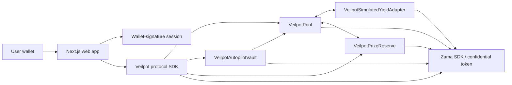

# Veilpot

**Confidential prize savings on Ethereum Sepolia, powered by the Zama Protocol.**

Veilpot is a full-stack confidential prize-savings dApp built for the Zama Developer Program Mainnet
Season 4 Bounty Track. Users save with confidential ERC-7984 assets, participate in periodic
encrypted prize draws, and automate bounded recurring contributions without publishing their
financial state or granting a keeper standing custody.

- **Live app:** https://veilpot.vercel.app
- **Network:** Ethereum Sepolia (`11155111`)
- **Reviewer guide:** [`docs/README.md`](docs/README.md)
- **Production status:** [`docs/PRODUCTION_STATUS.md`](docs/PRODUCTION_STATUS.md)
- **Frontend security model:** [`docs/FRONTEND_SECURITY_MODEL.md`](docs/FRONTEND_SECURITY_MODEL.md)
- **Reproducible verification:**
  [`docs/TESTING_AND_REPRODUCIBILITY.md`](docs/TESTING_AND_REPRODUCIBILITY.md)

> [!IMPORTANT] Veilpot is a **Sepolia testnet application**. The configured confidential token is
> Zama's official Confidential USDT Mock and the current yield adapter is simulated for the Season 4
> demonstration. Neither is represented as a production-mainnet asset or production yield source.

## What Veilpot solves

Prize savings should not require users to publish their deposits, balances, saving behavior, draw
weights, or prize entitlements. Veilpot keeps consequential financial state confidential while
preserving explicit user control over transactions, automation, decryption, recovery, and claims.

The product combines:

- confidential deposits and participant balances;
- confidential time-weighted draw participation;
- encrypted winner selection and prize entitlement;
- bounded Autopilot schedules instead of unlimited keeper authority;
- explicit, opt-in confidential-value decryption; and
- proof-aware recovery paths for asynchronous confidential settlement.

## Product flow

1. **Connect and authenticate.** Wallet connection, wallet-signature authentication, and on-chain
   transaction approval are separate user actions.
2. **Save privately.** Confidential deposit inputs are created for the exact Pool and submitting
   user. Public UI state never substitutes fabricated monetary values for encrypted balances.
3. **Automate safely.** Autopilot commits to exact schedule windows and a bounded lifetime
   authorization. Permissionless execution does not grant wallet custody or decryption authority.
4. **Enter VeilDraw.** Historical confidential saving weight is snapshotted and consumed by bounded
   encrypted winner-selection work.
5. **Claim deliberately.** Prize entitlement remains confidential. Decryption is opt-in and claim
   authorization is bound to the frozen historical beneficiary and exact EIP-712 domain.

## Confidentiality model

| State                          | Treatment         | User-facing disclosure                                   |
| ------------------------------ | ----------------- | -------------------------------------------------------- |
| Deposit amount                 | Confidential      | Never inferred from public state                         |
| Participant principal          | Confidential      | Explicit user-authorized decryption only where supported |
| Draw weight / TWAB             | Confidential      | Not exposed as public profile data                       |
| Autopilot period amount        | Confidential      | Owner-authorized inspection only                         |
| Autopilot lifetime cap / funds | Confidential      | Owner-authorized inspection only                         |
| Winner predicates              | Confidential      | No participant-wide public reveal                        |
| Prize entitlement              | Confidential      | Explicit beneficiary opt-in decryption                   |
| Protocol lifecycle state       | Public where safe | Used for progress, recovery, and finality UX             |

The browser does **not** automatically decrypt confidential values on page load, wallet connect,
session restoration, or background refresh.

## Architecture



### Layer responsibilities

- [`apps/web`](apps/web) — production Next.js interface, wallet authentication, safe public reads,
  explicit confidential actions, action review, and privacy-first rendering.
- [`packages/protocol-sdk`](packages/protocol-sdk) — framework-independent ABIs, deployment
  identity, state ordinals, call builders, EIP-712 claim construction, schedule construction, and
  Zama encryption helpers.
- [`packages/contracts`](packages/contracts) — Pool, Autopilot Vault, simulated yield adapter, Prize
  Reserve, production guards, deployment tooling, and adversarial contract tests.
- [`packages/reference-model`](packages/reference-model) — deterministic independent models for
  participant lifecycle, draw math, TWAB, yield/prize accounting, Autopilot, and claim rules.
- [`evidence`](evidence) — frozen Gate 0 and live Sepolia deployment/runtime evidence.

## Sepolia deployment

| Component                    | Address                                      |
| ---------------------------- | -------------------------------------------- |
| VeilpotPool                  | `0x2029D8b7AE6Abe7dAa0C2A71E960839171a34601` |
| VeilpotAutopilotVault        | `0x7dF64925Af938a0535F30dE9cFBf97BB3ab30487` |
| VeilpotSimulatedYieldAdapter | `0xEa9868e982b98B57C52B95853EdE2552dAD74b64` |
| VeilpotPrizeReserve          | `0xbEe24d1060d94d435272550fAa5616faD59Ad1a1` |
| Confidential USDT Mock       | `0x4E7B06D78965594eB5EF5414c357ca21E1554491` |
| Zama Wrappers Registry       | `0x2f0750Bbb0A246059d80e94c454586a7F27a128e` |

Canonical deployment evidence:
[`evidence/production-sepolia/autopilot-v3/deployment.json`](evidence/production-sepolia/autopilot-v3/deployment.json)

Canonical live lifecycle evidence:
[`evidence/production-sepolia/autopilot-v3/runtime-smoke.json`](evidence/production-sepolia/autopilot-v3/runtime-smoke.json)

## Security and privacy invariants

Veilpot is built around explicit consequence boundaries rather than optimistic UI assumptions.

### Exact transaction review

Before reviewed wallet actions are sent, the frontend binds the review to the connected sender,
chain, destination, exact calldata, native value, wallet transaction nonce, and a short freshness
window. A mined transaction is reconciled against the reviewed sender, destination, calldata, nonce,
and value before it is accepted as that exact action.

### Encrypted-input binding

Custom confidential inputs are constructed through `@veilpot/protocol-sdk` and bound to the exact
target contract and submitting user. Autopilot period amount and lifetime cap are encrypted under
one shared proof for the immutable Vault/owner pair.

### No standing keeper custody

Permissionless Autopilot execution cannot choose an arbitrary recipient, withdraw user Pool
principal, claim prizes, decrypt beneficiary state, or retain standing wallet token authority.

### Transfer-result accounting

Protocol accounting follows the confidential token's actual returned transfer amount rather than
assuming the requested amount moved. Partial and zero transfers therefore remain recoverable states
instead of silently corrupting obligations.

### Replay and stale-proof resistance

Registration identities, participant-global nonces, Autopilot plan/index commitments, claim nonces,
proof attempt nonces, and cryptographic contexts prevent stale or cross-context replay.

### Liveness and recovery

Reservation expiry, activation deadlines, proof refresh, missed-window advancement, revocation,
residual recovery, refund completion, and claim-completion evidence prevent locked-value paths from
becoming indefinite.

See [`docs/FRONTEND_SECURITY_MODEL.md`](docs/FRONTEND_SECURITY_MODEL.md),
[`docs/GATE_1_SECURITY_MODEL.md`](docs/GATE_1_SECURITY_MODEL.md), and
[`docs/AUTOPILOT_SECURITY_MODEL.md`](docs/AUTOPILOT_SECURITY_MODEL.md).

## Verification status

The current implementation has passed:

- **212** contract tests;
- **102** deterministic reference-model tests;
- **16** protocol-SDK tests;
- root Prettier validation;
- root ESLint and Solidity lint;
- root TypeScript project-reference typecheck;
- 45-file Solidity compilation under the local verification profile;
- Gate 0 deterministic/reference and VeilDraw verification;
- production Next.js build;
- live Sepolia deployment/runtime evidence verification;
- clean-checkout CI on Node 22; and
- final production browser acceptance on `veilpot.vercel.app`.

The CI pipeline runs install with the frozen lockfile, format, lint, typecheck, contract compile,
full root tests, and Gate 0. The lint stage deliberately builds the protocol SDK before type-aware
ESLint so a clean checkout does not depend on untracked `dist` output.

See [`docs/TESTING_AND_REPRODUCIBILITY.md`](docs/TESTING_AND_REPRODUCIBILITY.md).

## Local development

### Prerequisites

- Node.js `>=22 <23`
- pnpm `10.18.3`

```bash
corepack enable
pnpm install --frozen-lockfile
```

Run the web application:

```bash
pnpm --filter @veilpot/web dev
```

Run the complete repository gate:

```bash
pnpm check
```

Build the production web application explicitly:

```bash
pnpm --filter @veilpot/web build
```

No deployment private key is required for ordinary local frontend development or local Gate 0
verification. Live deployment tooling uses Hardhat variables outside the repository; see
[`.env.example`](.env.example) and the production runbooks before any network operation.

## Reviewer path

For a fast review, use this order:

1. Open the [live application](https://veilpot.vercel.app).
2. Read the [`docs/README.md`](docs/README.md) reviewer map.
3. Verify [`docs/PRODUCTION_STATUS.md`](docs/PRODUCTION_STATUS.md).
4. Inspect the current
   [deployment evidence](evidence/production-sepolia/autopilot-v3/deployment.json) and
   [runtime lifecycle evidence](evidence/production-sepolia/autopilot-v3/runtime-smoke.json).
5. Review [`docs/FRONTEND_SECURITY_MODEL.md`](docs/FRONTEND_SECURITY_MODEL.md) and
   [`docs/GATE_1_SECURITY_MODEL.md`](docs/GATE_1_SECURITY_MODEL.md).
6. Reproduce the test/CI boundary with
   [`docs/TESTING_AND_REPRODUCIBILITY.md`](docs/TESTING_AND_REPRODUCIBILITY.md).

Historical Gate documents under [`docs/`](docs) are retained as engineering provenance. They record
the state and reasoning at the time they were authored and are not the current top-level product
status source.

## Season 4 submission status

Engineering, deployment, production validation, and reviewer documentation are complete at the
current submission checkpoint. The required real-person three-minute demo and X thread/article are
submission media and can be linked from the reviewer guide once published.

## License

This repository is currently marked `UNLICENSED` in the root package metadata. No open-source
license is implied.
